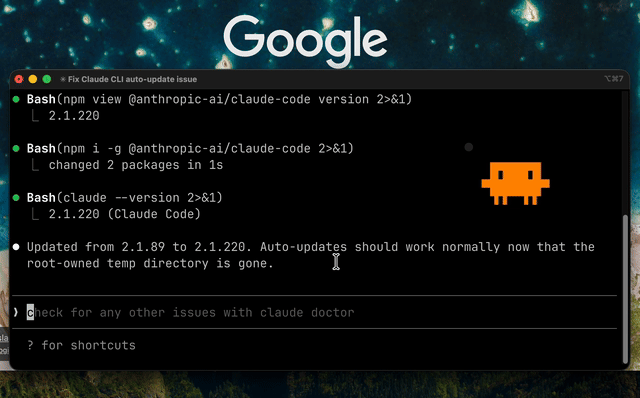

# clawd-mascot 🟠

A floating transparent animated desktop mascot for [Claude Code](https://claude.ai/code) on macOS.

Clawd lives on your desktop and reacts to what Claude is doing in real time — bobbing when idle, spinning when running tools, bouncing when done.



> **macOS only** — uses PyObjC (native macOS framework)

## States

| State | Animation |
|-------|-----------|
| Idle | Gentle bob up and down |
| Thinking | Bob + cycling dots `...` |
| Tool running | Fast shake left/right |
| Tool success | Green bounce |
| Tool failure | Red shake |
| Permission needed | Orange flash |

## Requirements

- macOS
- Python 3.8+
- PyObjC and Pillow:
  ```bash
  pip install pyobjc pillow
  ```

## Setup

### 1. Clone the repo

```bash
git clone https://github.com/sciencestoked/clawd-mascot.git
cd clawd-mascot
chmod +x hook.sh
```

### 2. Add Claude Code hooks

Add this to your `~/.claude/settings.json`, replacing `/path/to/clawd-mascot` with the actual path where you cloned the repo:

```json
{
  "hooks": {
    "SessionStart":       [{ "matcher": "", "hooks": [{ "type": "command", "command": "/path/to/clawd-mascot/hook.sh" }] }],
    "UserPromptSubmit":   [{ "matcher": "", "hooks": [{ "type": "command", "command": "/path/to/clawd-mascot/hook.sh" }] }],
    "PreToolUse":         [{ "matcher": "", "hooks": [{ "type": "command", "command": "/path/to/clawd-mascot/hook.sh" }] }],
    "PostToolUse":        [{ "matcher": "", "hooks": [{ "type": "command", "command": "/path/to/clawd-mascot/hook.sh" }] }],
    "PostToolUseFailure": [{ "matcher": "", "hooks": [{ "type": "command", "command": "/path/to/clawd-mascot/hook.sh" }] }],
    "PermissionRequest":  [{ "matcher": "", "hooks": [{ "type": "command", "command": "/path/to/clawd-mascot/hook.sh" }] }],
    "Stop":               [{ "matcher": "", "hooks": [{ "type": "command", "command": "/path/to/clawd-mascot/hook.sh" }] }],
    "SessionEnd":         [{ "matcher": "", "hooks": [{ "type": "command", "command": "/path/to/clawd-mascot/hook.sh" }] }]
  }
}
```

### 3. Run Clawd

```bash
python3 clawd_widget.py
```

Clawd will appear in the center of your screen. Open a Claude Code session and watch him react.

## Controls

- **Drag** the title bar area (above the mascot) to move him anywhere
- **Red dot** to close
- **Ctrl+C** in the terminal to quit

## How it works

- `hook.sh` — registered as a Claude Code lifecycle hook, writes the current state to `/tmp/clawd_state` on every event
- `clawd_widget.py` — native macOS PyObjC window (fully transparent, always on top) that reads `/tmp/clawd_state` and animates the mascot accordingly

The mascot pixel art is derived from the official Claude Code startup screen characters (`▐▛███▜▌`) upscaled with the correct terminal character aspect ratio.

## Credits

Built with Claude Code + Claude Sonnet 4.6
